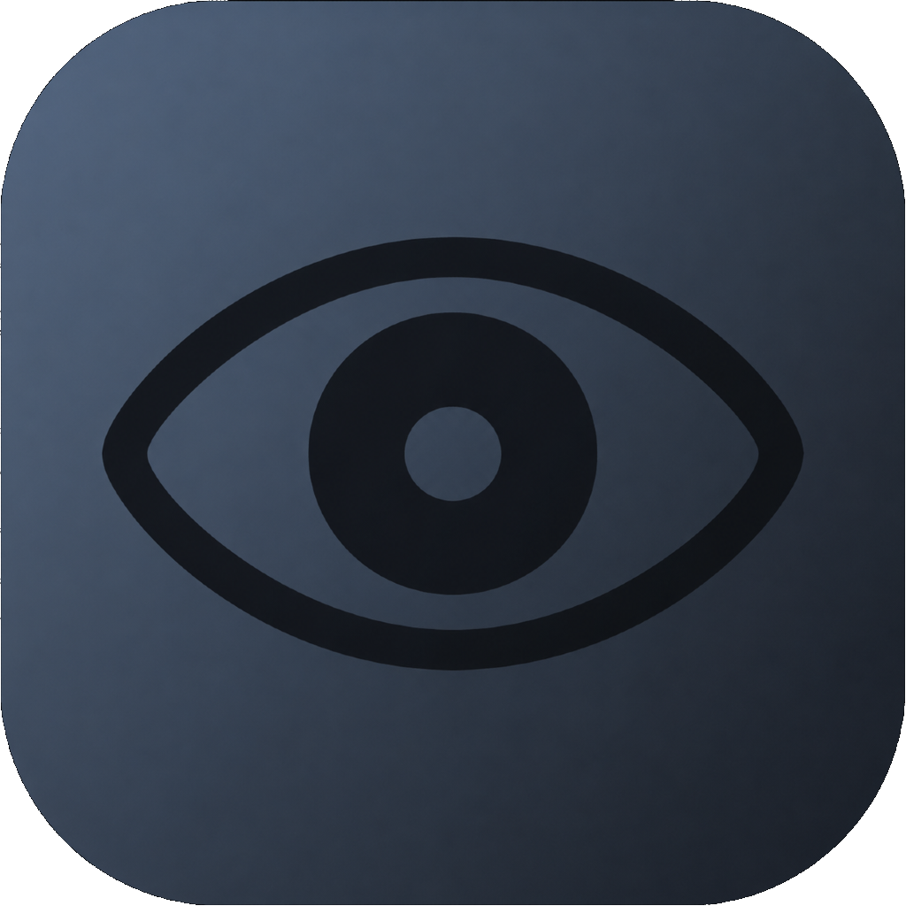

# Anonycord

**A discreet iOS video recorder that captures without a screen preview.**

---

Anonycord records video while the screen stays black. There is no live preview, no visible camera interface, and no bright display giving it away. You tap to start and stop, and recordings go to the photo library, a private Face ID vault, or both.

It is useful anywhere a lit-up camera screen gets in the way: filming in a dark room without the glow, lectures and talks, candid and street footage, personal documentation, and hands-free or eyes-free recording where you can't look at the screen. This is a fork of [c22dev/Anonycord](https://github.com/c22dev/Anonycord) with an expanded feature set.

## Table of Contents

- [Features](#features)
- [Installation](#installation)
- [Building from Source](#building-from-source)
- [Releases and CI](#releases-and-ci)
- [Settings Reference](#settings-reference)
- [The Vault](#the-vault)
- [Reduce White Point Shortcut (Covert purposes)](#reduce-white-point-shortcut-covert-purposes)
- [Notes and Caveats](#notes-and-caveats)
- [Roadmap](#roadmap)
- [Credits](#credits)
- [License](#license)

## Features

- **No-preview recording.** The screen stays black while filming. The whole screen acts as the start/stop control, so you never need to find a button.
- **Video, audio, and stills.** 4K or 1080p video on wide, selfie, or ultrawide cameras, audio-only recording with adjustable sample rate and channels, and photo capture.
- **Haptic feedback.** One pulse when recording starts, two when it stops, so you get confirmation without looking.
- **Hardware trigger.** Start recording with a volume button instead of a tap. The system volume overlay is suppressed while active.
- **Auto-start.** Begin recording a set number of seconds after launch, with no interaction.
- **Blackout mode.** A fully blank screen with no status bar, home indicator, or controls. Tap anywhere to start and stop, press and hold to reach settings. Brightness drops to the floor while active and restores when you leave.
- **Flexible save destinations.** Send recordings to the photo library, a private in-app vault, or both.
- **Private vault.** Recordings kept inside the app sandbox, hidden from Photos and Files, opened with Face ID.
- **Album sorting.** Library saves can be grouped into a dedicated Anonycord album automatically.

## Installation

There is no App Store build. You install the unsigned IPA with a sideloading tool such as AltStore, Sidestore, Sideloady, or TrollStore.

1. Download `Anonycord.ipa` from the Assets of this release.
2. Open or import it in your sideloading tool, which signs the app with your own account.
3. Install to your device.

Camera, microphone, photo library, and Face ID permissions are requested on first use. iOS 15 or later.

Building it yourself from `main`, or pulling the IPA from a CI run instead of a release, is covered in [Building from Source](#building-from-source) and [Releases and CI](#releases-and-ci) below.

## Building from Source

Open `Anonycord.xcodeproj` in Xcode and run on a physical device. The simulator cannot use the camera, volume buttons, or Face ID. The project uses synchronized folder groups, so new source files are compiled automatically without editing the project file.

Minimum deployment target is iOS 15.

## Releases and CI

The build is handled by `.github/workflows/build.yml` on a macOS runner. It pins a recent Xcode, produces an unsigned archive, packages it into an IPA, and uploads it. Signing is intentionally left out, your sideloading tool signs the app on device.

| Trigger | Result |
| --- | --- |
| Push to `main` | Builds an unsigned IPA and uploads it as a workflow artifact |
| Push a tag matching `v*` | Builds the IPA and attaches it to a GitHub release |
| Manual run | Same as a push, triggered from the Actions tab |

## Settings Reference

| Setting | Description |
| --- | --- |
| Video quality | 4K or 1080p |
| Camera | Wide, Selfie, or UltraWide |
| Sample rate / channels | Audio recording format |
| Haptic feedback | Pulse on start and stop |
| Volume button trigger | Start recording with a volume button |
| Auto-start | Begin recording after launch |
| Blackout | Fully blank screen, tap to record, hold for settings |
| Save destination | Library, Vault, or Both |
| Album sorting | Group library saves into an Anonycord album |
| Show recording info | Display current parameters on the main screen |
| Crash upon saving | Quits the app after a save (inherited from the original) |

## The Vault

The save destination setting controls where recordings end up:

- **Library** saves to Photos, and to the Anonycord album when sorting is on. Clips appear in Recents like any normal recording.
- **Vault** keeps recordings inside the app's own storage, hidden from Photos and the Files app. The viewer is gated behind Face ID, and nothing leaves the device.
- **Both** writes a normal copy to Photos and keeps a private copy in the vault.

The vault lives in the app sandbox. Recordings stored there are removed if the app is deleted or a reinstall goes wrong, so choose Both if you want a copy that survives that.

## Reduce White Point Shortcut (Covert purposes)

An app cannot toggle Reduce White Point on its own, but the Shortcuts app can. Build a shortcut with three actions in order:

1. Set White Point, On
2. Set Brightness, 0%
3. Open App, Anonycord

Place it on the home screen or the Action Button. A single tap reduces the white point, floors the brightness, and opens the app ready to record. Adjust the dimming amount once under Settings, Accessibility, Display and Text Size.

## Notes and Caveats

- Tested on iOS 26 with a minimum target of iOS 15.
- The volume button trigger relies on undocumented behaviour. Test the exact start and stop sequence you intend to use before depending on it.
- Face ID requires the `NSFaceIDUsageDescription` key, which is set in the project build settings. Without it, opening the vault would crash.
- Blackout floors the system brightness and restores it when you leave blackout or background the app, so the device is never left dark.

## Roadmap

- Second-device remote control, so an operator can start, stop, or monitor recording from a paired phone over a local peer-to-peer connection.
- Front and back simultaneous capture.
- Optional recording time limit and auto-stop.

## Credits

Original app by [c22dev](https://github.com/c22dev). Forked and extended by [Jack Ghafari](https://github.com/jackghx).

## License

Licensed under GPL-3.0. See [LICENSE](LICENSE).
